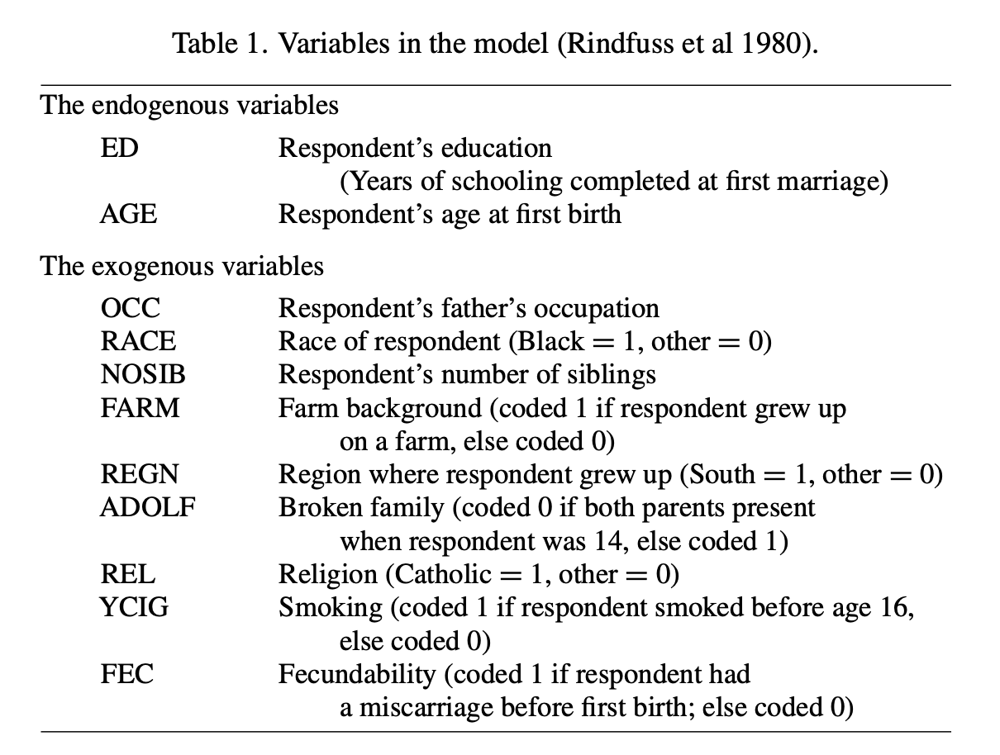

```{r setup, include=FALSE}
library(learnr)
library(tidyverse)
knitr::opts_chunk$set(echo = FALSE)
```

## Today's plan

1. Announcements 
1. Instrumental Variables and two-stage least squares
1. HW / Project Questions 

## Announcments

1. Project 2: Due Oct 4 

## Instrumental Variables and two-stage least squares

The material that will be covered here is based on the reading in Chapter 9 of the Freedman textbook. 

Suppose that we want to fit the following regression model:

$$
Y = X\beta + \delta,
$$
where $Y \in \mathbb{R}^{n}$ is a response variable that we are interested in, $X \in \mathbb{R}^{n \times p}$ is our covariate matrix, and $\delta \in \mathbb{R}^n$ is a vector of random errors that satisfies $E(\delta) = 0$, $E[\delta^t\delta] < 0$. 
Our goal is to estimate $\beta$. 
If we assume that $E[\delta|X] = 0$, then we can use the OLS estimate:
$$
\hat{\beta}^{OLS} = (X^TX)^{-1}X^TY,
$$
but what if $E[\delta|X] \neq 0$? This is where instrumental variable regression, or two-staged regression, comes into play. 

Suppose that there exists a matrix $Z \in \mathbb{R}^{n \times q}$, and that satisfies the following assumptions are satisfied:

1. $n > q \geq p$.
1. $Z^TX$ and $Z^TZ$ are both full rank.
1. The $\delta_i$ are mean zero, finite variance, IID random variables.
1. $Z$ is *exogenous*, i.e., $Z$ and $\delta$ are independent.

Then, we can fit two-staged regression to the model:
$$
Y = X\beta + \delta
$$
By the second assumption, we know that $Z^TZ$ has an inverse, which has a square root. We denote this by $M = (Z^TZ)^{-1/2}$.
Now we can use this to make a transformation to the equation $Y = X\beta + \delta$ in order to perform least squares. 
Namely, we note that $E[(Z^TZ)^{-1/2}Z^T\delta|Z] = 0$, and $\text{cov}((Z^TZ)^{-1/2}Z^T\delta|Z) = 0$, so by (left) multiplying the equation for $Y$ by $(Z^TZ)^{-1/2}Z^T$, we obtain: 

$$
Y^* = X^*\beta + \delta^*,
$$
that (almost) satisfies all of the OLS assumptions, where $Y^* = (Z^TZ)^{-1/2}Z^TY$, $X^* = (Z^TZ)^{-1/2}Z^TX$, and $\delta^* = (Z^TZ)^{-1/2}Z^T\delta$. 
Therefore the solution is given as:
$$
\hat{\beta}^{IVLS} = \big((X^*)^TX^*\big)^{-1}(X^*)^{T}Y^*
$$
Substituting in the values of $X^*$ and $Y^*$, and a little bit of algebra, gives the result: 

$$
\hat{\beta}^{IVLS} = \big(X^TZ(Z^TZ)^{-1}Z^TX\big)^{-1}X^TZ(Z^TZ)^{-1}Z^TY
$$
The one issue of concern is that $X^*$ and $\delta^*$ do have some correlation, as $X^*$ is a function of $X$, which is correlated to $\delta^*$, which is a function of $\delta$. 
See chapter 9 for more details. 

## Alternative approach: 

An alternative approach to the same problem is called *two-staged regression*. 
The idea behind this is that the reason we can't use OLS in the first place is because the error term is correlated with some of the predictor variables. 
Therefore, what if somehow "remove" the part of the covariate that is correlated with the errors via regression. 

Therefore, in the first stage, we have the regression equation:  
$$
X = Z\gamma + \epsilon, 
$$
In this case, our assumption is that $Z$ and $\epsilon$ are independent. Using the OLS estimate $\hat{\gamma}^{OLS}$, we can then get a version of $X$ that is no longer correlated with $\delta$: $\hat{X} = Z\hat{\gamma}^{OLS}$, and use that in our second stage:
$$
Y = \hat{X}\beta + \delta 
$$
Our final estimate of $\beta$ is then: 
$$
\hat{\beta}^{IISLS} = \big(\hat{X}^T\hat{X}\big)^{-1}\hat{X}^TY
$$
This idea has been around longer than instrumental variable regression, but it turns out that they give the same answer (this is a fun exercise, or you can look at the proof in chapter 9). 

## Instrumental Variable Regression Implementation

Now let's try doing instrumental variable regression with a real data set. 
This example will continue with a model that was described in Chapter 9.5; 
This model was used by Rindfuss et al to make inference about a woman's education level (ED) and age at first birth (AGE). 
The model uses the following simultaneous equations: 
$$
\mathrm{ED} = a_0 + a_1\mathrm{AGE} + a_2\mathrm{OCC}_i + a_3\mathrm{RACE}_i + \ldots + a_{10}\mathrm{YCIG}_i + \delta_i
$$
$$
\mathrm{AGE} = b_0 + b_1\mathrm{ED} + b_2\mathrm{FEC}_i + b_3\mathrm{RACE}_i + \ldots + b_{10}\mathrm{YCIG}_i + \epsilon_i
$$

Descriptions of all of the variables are given in the table below.

<center>

{width=80%}

</center>

Your mission, should you choose to accept it, is to estimate parameters in the standardized equations that explain ED and AGE. 

While we don't have access to the original dataset, we do have access to the correlation matrix for each of the standardized variables (so that the columns were mean 0 and variance 1 before the correlation was calculated). The correlations of the first 6 variables are printed below: 

```{r}
tmp <- read.table('data/rindcor.dat') |> as.matrix()
COV <- tmp + t(tmp) - diag(nrow(tmp))
colnames(COV) <- c("OCC", "RACE", "NOSIB", "FARM", "REGN", "ADOLF",
                   "REL", "YCIG", "FEC", "ED", "AGE")
rownames(COV) <- colnames(COV)
COV[1:6, 1:6]
```

As a reminder, here is the eqation to estimate the coefficients: 

$$
\hat{\beta}^{IVLS} = \big(X^TZ(Z^TZ)^{-1}Z^TX\big)^{-1}X^TZ(Z^TZ)^{-1}Z^TY
$$
```{r IVLS, exercise=TRUE, exercise.lines=20}
# Read in the data 
tmp <- read.table('data/rindcor.dat') |> as.matrix()
COV <- tmp + t(tmp) - diag(nrow(tmp))  # remove zeros 

# Name columns and rows
colnames(COV) <- c("OCC", "RACE", "NOSIB", "FARM", "REGN", "ADOLF",
                   "REL", "YCIG", "FEC", "ED", "AGE")
rownames(COV) <- colnames(COV)

# TODO: get IVLS estimate
```

```{r IVLS-hint-1}
# It's helpful to create a named vector to select columns that you want, something like this: 
z_cols <- c(
  'FEC', 'RACE', "NOSIB", "FARM",
  "REGN", "ADOLF", "REL", "YCIG", 'OCC'
  )
```

```{r IVLS-hint-2}
# Because the columns were standardized, the correlation between 
# various columns can be a useful matrix product. 
```

### Follow up questions: 

- Rindfuss et al results are printed in the back of the Freedman textbook. Did you get the same coefficients that they reported? Are they close? If not, why might they be different? 
- What about model assumptions? Do they make sense for this data / model? 
- Consider estimating the SE of the estimates. HINT: use equation 9.14 from the textbook. 

## HW / Project Questions

We will treat this time as an extra set of office hours. 
