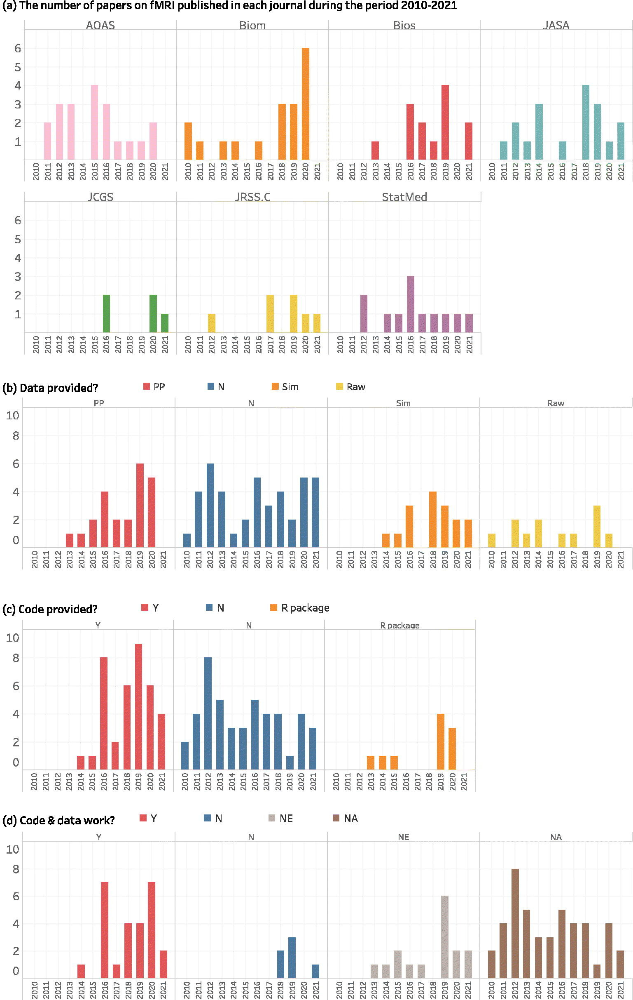

```{r setup, include=FALSE}
library(learnr)
library(tidyverse)
knitr::opts_chunk$set(echo = FALSE)
```

## Today's plan

1. Announcements 
1. Discuss the paper: Xiong, X., Cribben, I. 2023. The State of Play of Reproducibility in Statistics: An Empirical Analysis. The American Statistician. 
1. HW / Project Questions 

## Announcments

1. Project 3: Officially due Oct 25, may be pushed back. 

## Xiong, X., Cribben, I. 2023.

- Recent paper from the American Statistician. 
- Adds to a long list of papers demonstrating the "reproducibility crisis" in science. Some examples:
   - Ioannidis, 2005. Why Most Published Research Findings Are False. PLOS Medicine. 
   - Simmons, J. P., Nelson, L, D., Simonsohn, U., 2011. False-Positive Psychology: Undisclosed Flexibility in Data Collection and Analysis Allows Presenting Anything as Significant. Psychological Science. 
   - Camerer, C., et al., 2015. Evaluating the replicability of social science experiments in Nature and Science between 2010 and 2015. Nature. 
- This paper attempts to focus on reproducibility issues within the field of Statistics (I don't think they really accomplished this goal).

## Reproducibility

A poll conducted by the journal *Nature* in 2016 reported that $52\%$ of scientists surveyed believed science is facing a "replication crisis". 

Issues:

- Inflated false positives
- Lack of transparency about how studies are conducted. 
- Lack of systematic approach for describing methods, computer code, and analysis. 
  - Sometimes code / data is not provided. 
  - Custom workflows, combined with limited instructions, make code difficult to run. 
  - Some code requires specific computational environments and / or software versions. 
- Others? 

Why does it matter? 

## Reproducibility in Statistics Journals 

The paper makes a statement about the overall reproducibility in Statistics journals. 
In particular, they look at papers from the following journals: 

- Annals of Applied Statistics 
- Biometrics 
- Biostatistics
- The Journal of Computational and Graphical Statistics
- The Journal of the American Statistical Association
- The Journal of the Royal Statistical Society: Series C
- Statistics in Medicine. 

Evaluating the reproducibility of **all** papers / topics across statistics is a near impossible task. 
To make this feasible, they limited themselves to studies that involve fMRI data, specifically rom 2010-2021. 
All seven of the journals considered either require submission of data and code, or strongly encourage making the data and code publicly available.

## Methodology 

- Identified 93 papers analyzing fMRI data from these seven journals.
- Assigned multiple human readers to verify whether or not code / data were available. 
- If code was provided, tried to run the code. 
   - If the code fails, they try to fix all errors (both major and minor). If the code would work after fixing the errors, they consider this as "working code". Reasons code breaks include: 
      - Code is not executable (e.g., there are functions provided but there is a key file missing).
      - Missing important functions / data. 
      - Pre-processed data is not available, and there is not enough description in the paper to effectively reproduce the data processing step. 
- The definition of "reproducibility" was very lenient, as they allowed for the possibility of non-meaningful differences in results due to the randomness of the statistical methodology used. 

Any guesses about the relative proportion of these studies that are fully reproducible? 
How many provided all of the code? 
How many provided all of the data? 

## Results

### Code 

Of the 93 papers that were identified, 46 ($49\%$) provide no code at all. 
Of the $47$ that did provide code, $26$ ($28\%$) runs (after fixing bugs when possible), 
$5$ ($5\%$) where the code provided failed, 
and $16$ ($17\%$) where the code included was not executable (e.g., `R` functions are provided but there are missing files that are required). 

$10$ papers provide an `R` package, but only $3$ contains scripts that can reproduce the results of the paper.  

### Data

$42$ ($45\%$) of the papers had no real, simulated, or raw data. 
23 ($25\%$) provide the real fMRI data analyzed in the paper, 16 ($17\%$) provide simulated data, and 12 ($13\%$) provide the raw data. 

### Both

Only 14 out of 93 papers ($15\%$) were reproducible in the sense that (1) the code was publicly available and executable (2) the preprocessed data was available, or the raw data + a script to process the data was available (3) the results of re-running the code were similar enough to the results reported in the paper. 

### Software Note

`R` was the most frequently used language (33/47 papers with provided code), and Matlab was the next most used (14/47 papers used Matlab exclusively, or in conjunction with other languages, they don't give more details about this). 

{width=100%}

We won't go into more detail about some of these numbers, but there are some additional details in this study that you could find interesting.
For example, they break down the same numbers by each journal.
Furthermore, in their supplement material, they have a table that contains information about all 47 studies that included code, specifying why they characterized the code the way they did (e.g., providing specific examples of where the code broke or otherwise wouldn't run).

The authors' primary conclusion: 

> In this article, we have explored the reproducibility of applied and methodological papers in the field of statistics by considering all the papers (n = 93) based on functional magnetic resonance imaging (fMRI) data published in seven prominent statistical journals during the time period 2010–2021. Although statisticians pride themselves on open computer code (through the sharing of scripts or the creation of packages), we found an overall common lack of transparency and openness in both the computer code and datasets illustrating the statistical methods and applications, which raises the urgent need for attention and action. Below, referring to the narrative in Stodden et al. (Citation2016), we list our recommendations for authors, editors/journals, reviewers, and funding organizations to facilitate reproducibility in statistics in general (or fMRI applications specifically) but also across other quantitative research domains.

## Suggestions 

I think we can agree this is a problem. 
In the paper, the authors make a few suggestions to improve the state of reproducibility in statistics. 

### Code 

- Authors should provide detailed computer materials, including step-by-step workflows to demonstrate reproducibility. 
- If possible, the visualization tool and the computation time should also be included. 
- Include all dependent data and files (any data / file that is required to run the analysis), sufficient enough data in order to reproduce the results without having to contact the authors. 
- Authors should share their computer code in an appropriate public repository by using persistent links (personal websites don't make the cut, and GitHub isn't ideal either). **Personal note:** I think that GitHub is a good place to work on your code and make it publicly available, but GitHub repositories can be permanently altered or removed, and the history can also be manipulated. 
Therefore once your project is ready for submission, you should use some sort of archive like Zenodo, which has a very nice GitHub integration that makes it very easy to take a permanent and persistent link to a *snapshot* of your current GitHub repo. 
- "it is critical to provide manuals and clear paper scripts with lucid, straightforward instructions on the steps necessary to regenerate the results."


### Data

- Authors should provide the preprocessed data as a supplementary file rather than a link to a public dataset with just a raw version. This is because even with precise data processing details (which are not always included), it can be difficult if not impossible to entirely recreate the dataset used in the analysis. 
- At the very minimum, provide a link to the public raw data, and a functional script that can reproduce the results. 

### Additional Suggestions: 

- Have journals impose a reproducibility check (both for new and existing papers). This could include requiring reviewers to assess the reproducibility of the paper.
- Change journal wording from "encourage", "expect", and "should" to "require" and "must" in regards to code and data availability requirements. 

### Final Thoughts 

- Do you think that the authors' suggestions are reasonable? Will they published statistical analysis more reproducible? 
- What are additional recommendations that could help? 

Here are some additional recommendations that I think should be implemented: 

- If you are using `R` in your study, you should use a `.Rnw` file that will create the paper. 
- At a minimum, you should provide detailed information about your particular computing environment. This includes the type of computer you are using, the version of `R` / `python` you are using, the version of computational packages on which `R` / `python` rely, and the versions of all packages / librarys that were used. If you're in `R`, and using a `.Rnw` file, this can easily be done by running the command: `sessionInfo()`: 

```{r, echo=TRUE}
# cat(
#   utils::capture.output(sessionInfo()),
#   file = "sessionInfo.txt",
#   sep="\n"
# )

sessionInfo()
```

- Even better, we could use self-contained software environments that will allow others to simply load our specific computational environment and run it themselves. Tools to do this include [`renv`](https://rstudio.github.io/renv/articles/renv.html) in `R` and Miniconda / Conda in `python`. 
- Your entire analysis should be able to be reproduced from a single file, or a relatively short and simple set of instructions. Again, `.Rnw` makes this easy in `R`. Also, `makefiles` can be very useful for this purpose, but be sure to include instructions on how to use these files. 
- Nothing that you submit as part of your analysis should be created by code that you don't submit / make publicly available, including results in the supplement, figures, and tables. 
- Highly computationally expensive jobs should, when possible, include code that can be ran in a short amount of time and provide partial results. For example, suppose that you do a simulation study in your paper that requires hundreds of thousands of simulations. Then, it should be relatively easy for *someone else* to run just a few of these simulations. This can be done using "Run Levels": 

```{r, eval=FALSE, echo=TRUE}
RUN_LEVEL <- 1  # At the top of a document, prefereably a .Rnw document

Number_of_simulations <- switch(RUN_LEVEL, 50, 1000, 100000)

sim_data <- do_simulations(n = Number_of_simulations)
ggplot(sim_data, ...)
```

- Finally, researchers should *strive* not only for reproducibility, but *extendability*. This can be hard to do, and even if you try, it's hard to know if you have succeeded. 
   - If *someone else* wants to change / modify something in my analysis, it should be relatively easy for them to do so. For example, it should be easy for them to modify / add a figure if they have your code (`ggplot` makes this easy). 
   - Another example: suppose in your paper you have a complicated model that is both difficult to evaluate and callibrate to data. You could write code like the following: 
   
```{r, echo=TRUE, eval=FALSE}
my_model <- create_model()
fitted_model <- fit_model(my_model)
model_evaluation <- evaluate_model(fitted_model)
```

In this example, you could have an `R` package the defines the functions `create_model`, `fit_model`, and `evaluate_model`, where all of these functions are well documented. 
Then if a researcher wants to change the model slightly, they know that they only need to modify the `create_model` function.
Alternatively, if they want to change the way the model is calibrated to data, they can keep the model the same, and change the function `fit_model`. 

What are your thoughts? Is this too extreme? Not extreme enough? Other recommendations? 

## HW / Project Questions

We will treat this time as an extra set of office hours. 
