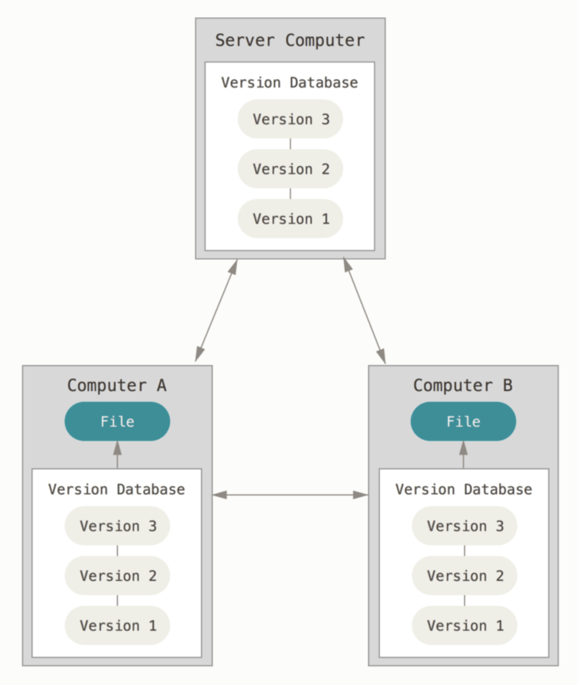
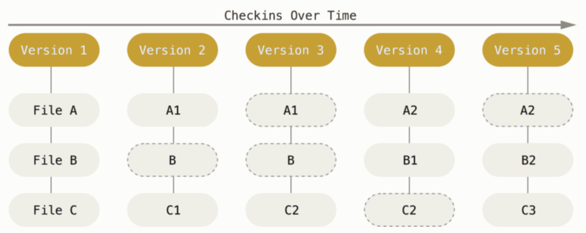
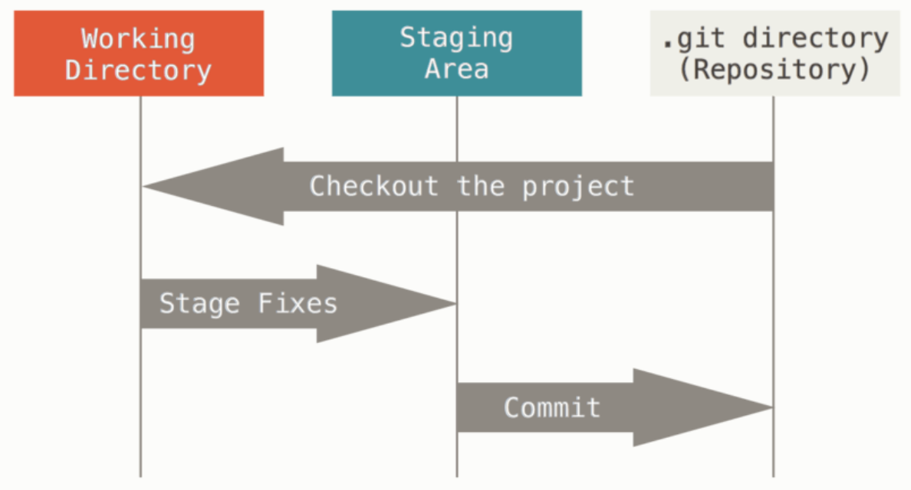
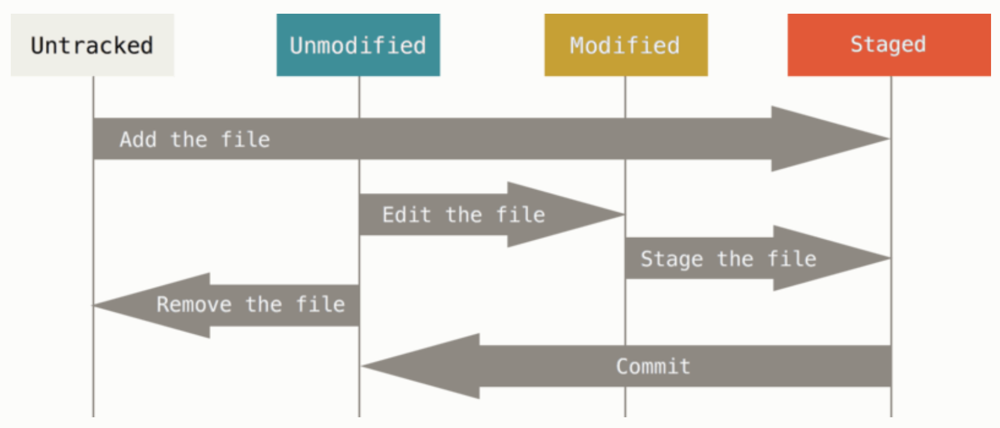

```{r setup, include=FALSE}
library(learnr)
library(tidyverse)
knitr::opts_chunk$set(echo = TRUE, eval = FALSE)
```

## Today's plan

1. Announcements 
1. Reproducibility tools: Git 
1. HW / Project Questions 

## Announcments

1. Project 3: Nov 1. 

## Git

Much of this material is copied from the open source [git book](https://git-scm.com/book/en/v2)

`git` is a very popular Version Control system.

- What is version control:
> "Version control is a system that records changes to a file or set of files over time so that you can recall specific versions later." 

The files that are watched are often source code, but they can be any type of file on your system. 

> "If you are a graphic or web designer and want to keep every version of an image or layout (which you would most certainly want to), a Version Control System (VCS) is a very wise thing to use. It allows you to revert selected files back to a previous state, revert the entire project back to a previous state, compare changes over time, see who last modified something that might be causing a problem, who introduced an issue and when, and more. Using a VCS also generally means that if you screw things up or lose files, you can easily recover. In addition, you get all this for very little overhead."

- `git` is a *Distributed Version Control System* (DVCS). This effectively means that the entire file system is contained in both local computers and remote servers (often `GitHub`).

{width=100%}

### Git History 

Linux based operating systems are very fast and light-weight, so practically all large computing clusters (like Great-Lakes) are Linux based. 
In 2002, the Linux kernel project began using a proprietary DVCS called BitKeeper.

In 2005, the relationship between the community that developed the Linux kernel and the commercial company that developed BitKeeper broke down, and developers could no longer use BitKeeper for free. 
This prompted the Linux development community (and in particular Linus Torvalds, the creator of Linux) to develop their own tool based on some of the lessons they learned while using BitKeeper. 
Some of the goals of the new system were as follows:

- Speed
- Simple design 
- Strong support for non-linear development (thousands of parallel branches)
- Fully distributed
- Able to handle large projects like the Linux kernel efficiently (speed and data size)

Since its creation in 2005, Git has evolved and matured to be easy to use and yet retain these initial qualities. 
It’s amazingly fast, it’s very efficient with large projects.

### What is Git 

Git thinks of its data like a series of snapshots of a miniature filesystem. 
With Git, every time you commit, or save the state of your project, Git basically takes a picture of what all your files look like at that moment and stores a reference to that snapshot.
To be efficient, if files have not changed, Git doesn’t store the file again, just a link to the previous identical file it has already stored.
Git thinks about its data more like a stream of snapshots.

{width=100%}

Most operations in Git need only local files and resources to operate — generally no information is needed from another computer on your network. 

If you’re used to a CVCS where most operations have that network latency overhead, this aspect of Git will make you think that the gods of speed have blessed Git with unworldly powers. Because you have the entire history of the project right there on your local disk, most operations seem almost instantaneous.

For example, to browse the history of the project, Git doesn’t need to go out to the server to get the history and display it for you — it simply reads it directly from your local database.
This means you see the project history almost instantly. 
If you want to see the changes introduced between the current version of a file and the file a month ago, Git can look up the file a month ago and do a local difference calculation, instead of having to either ask a remote server to do it or pull an older version of the file from the remote server to do it locally.

This also means that there is very little you can’t do if you’re offline or off VPN. 
If you get on an airplane or a train and want to do a little work, you can commit happily (to your local copy, remember?) until you get to a network connection to upload.
If you go home and can’t get your VPN client working properly, you can still work.
In many other systems, doing so is either impossible or painful. 

**Integrity**: 
It’s impossible to change the contents of any file or directory without Git knowing about it. 
This functionality is built into Git at the lowest levels and is integral to its philosophy.
You can’t lose information in transit or get file corruption without Git being able to detect it.

When you do actions in Git, nearly all of them only add data to the Git database. 
It is hard to get the system to do anything that is not undoable or to make it erase data in any way. 
As with any VCS, you can lose or mess up changes you haven’t committed yet, but after you commit a snapshot into Git, it is very difficult to lose, especially if you regularly push your database to another repository.

This is one of the main reasons Git is such a beloved tool: we know we can experiment without the danger of severely screwing things up.

### Three stages of Git

Git has three main states that your files can reside in: modified, staged, and committed:

- Modified means that you have changed the file but have not committed it to your database yet.
- Staged means that you have marked a modified file in its current version to go into your next commit snapshot.
- Committed means that the data is safely stored in your local database.

These three states that our files can take correspond with the three main sections of a Git project: the working tree, the staging area, and the Git directory.

{width=100%}
The working tree is a single checkout of one version of the project. These files are pulled out of the compressed database in the Git directory and placed on disk for you to use or modify.

The staging area is a file, generally contained in your Git directory, that stores information about what will go into your next commit. Its technical name in Git parlance is the “index”, but the phrase “staging area” works just as well.

The Git directory is where Git stores the metadata and object database for your project. This is the most important part of Git, and it is what is copied when you clone a repository from another computer.

The basic Git workflow goes something like this:

- You modify files in your working tree.
- You selectively stage just those changes you want to be part of your next commit, which adds only those changes to the staging area.
- You do a commit, which takes the files as they are in the staging area and stores that snapshot permanently to your Git directory.

If a particular version of a file is in the Git directory, it’s considered committed. If it has been modified and was added to the staging area, it is staged. And if it was changed since it was checked out but has not been staged, it is modified.

### Config file

If you haven't used Git before, then one of the first things you'll want to do is modify Git configurations. 
These configurations are stored in three possible ways: 

- system wide: everyone on the system will have these configurations 
- User specific: every git project made by a user will have the configurations in this file - Project specific: configurations that are only used for a specific Git project. 

These files can be modified "by hand", but here we will just focus on using built-in Git commands to see / modify the contents of these files. 
To see what is in these files, you could run the command: 

```{bash, eval=FALSE, echo=TRUE}
git config --list --show-origin
```

If you haven't already done so, the first thing you should do after installing Git is set your user name and email address. This is important because every Git commit uses this information, and it’s immutably baked into the commits you start creating:

```{bash, eval=FALSE, echo=TRUE}
git config --global user.name "John Doe"
git config --global user.email johndoe@example.com
```

Using the `--global` option makes it so that you only need to run this command once; all future Git projects you work on will have this stored for you already. 

Another thing you may want to do is set up which tool you prefer to use as a command-line-editor. 
Git defaults to the system default, but you can specify the editor that you would like to use: 

```{bash, echo=TRUE, eval=FALSE}
git config --global core.editor emacs
```

One final setting you (possibly) want to modify is the default name for a branch in a brand new Git repository (the default might be `master`, but it is now favored and good practice to use the name `main` instead): 

```{bash, echo=TRUE, eval=FALSE}
git config --global init.defaultBranch main
```

### If you need help

You just need to ask for it: 

```{bash, echo=TRUE, eval=FALSE}
git help <verb>
```

where `<verb>` is a command you would like to know more about. 
This command will pull up the manual for this function, but it is often more information than you need. 
If you just want a quick refresher on possible options, you can add a `-h` at the end of the command instead: 

```{bash, echo=TRUE, eval=FALSE}
git help config -h 
```

## Git basics:

### Creating Git repository
In order to use Git, you are going to need a Git repository. 
You typically obtain a Git repository in one of two ways:

- You can take a local directory that is currently not under version control, and turn it into a Git repository. To do this, navigate (command line) to the directory you would like to be a Git repository and type: 

```{bash, eval=FALSE, echo=TRUE}
git init
```

- You can clone an existing Git repository from elsewhere. You've probably done this before, but navigate (command line) where you would like the repository to be located and then clone it using something like: 

```{bash, eval=FALSE, echo=TRUE}
git clone https://github.com/stats604/stats604.git
```

### Recording Changes 

The primary reason we use git is to keep track of all changes we make to the repository. 
Each repository has two basic kinds of files: *tracked* and *untracked*. 
As the name suggests, *tracked* files are those that have had a snapshot and are therefore saved in the Git repository; *untracked* files exist in our working tree, but not in the Git system. 

{width=100%}

The see what status each of the files in the system has, we can use the handy command: 

```{bash, eval=FALSE}
git status
```

This command tells you: 

- Which branch you are on (more on this later)
- If there are any untracked files
- Are there any changes to tracked files. 
- Sometimes suggest commands that you might find useful. 

### Interactive example 

Let's do an interactive example together.
We will create a new Git repo(sitory), add some files, commit, modify, delete, and see what happens. 

### `git commit` 

To commit a file, which takes the snapshot of your directory, you first need to stage the file via `git add <filename>`, or if you want to add all of the files in the working tree, you can use `git add .`. 

You then run `git commit` to commit the changes that have been staged. 
Note that if you run `git commit`, your default command line editor will open up for you to leave a *commit message*, which describe what the commit is all about. 
Typically, we don't need to open up the editor because commit messages, so instead we can use the `-m` tag to make a commit message in-place: 

```{bash, echo=TRUE, eval=FALSE}
# Add (stage) all .Rmd files
git add *.Rmd

# Commit these changes with a message
git commit -m "commited all '.Rmd' files" 
```

### .gitignore 

There are often files that you don't want to keep track of.
For example, you might not always want to track the `.html` file that is the output of rendering a `.Rmd` file. 
To keep these types of files out of your `git status` update, we can create a `.gitignore` file and add file names to it. Here's what my `.gitignore` file looks like for the `stats604` repository: 

```{bash, eval=TRUE, comment=NA}
# Note that this code actually runs, don't put anything sensitive there.
cat ../../.gitignore
```

### git log

`git log` is a handy command that will let you see a brief history of all of the commits. 
This command has lots of options, which I recommend looking into here: [Git Book: Viewing the Commit History](https://git-scm.com/book/en/v2/Git-Basics-Viewing-the-Commit-History). 

Here are some examples that I find handy: 

```{bash, eval=FALSE, echo=TRUE}
# Just the basic command, gives a lot of information
git log 

# Show the last two commits, plus their diffs: 
git log -p -2
```

Sometimes a visual helps: 

```{bash, eval=TRUE, echo=TRUE, comment=NA}
git log --graph
```

Or a slightly more compact version: 

```{bash, eval=TRUE, echo=TRUE, comment=NA}
git log --pretty=format:"%h %an %s" --graph
```

You actually get some colored output if you run this on command line. 

### git remotes 

While Git is useful in its own right for use on a local computer, it's particularly useful when we have our repository connected to external locations, called *remotes*. 

Recall there are two ways to create a Git repository on your computer: 

- Clone an existing repository: in this case, the remote will be set up as `origin` for you. 
- Creating a new repository: in this case you need to set up the remote yourself. 

To add a remote to your repo, you can do the following: 

```{bash, eval=FALSE, echo=TRUE}
git remote add <shortname> <url/ssh>

# Example: Add "jesseFork" remote to your local Git repository: 
git remote add jesseFork https://github.com/jeswheel/stats604.git
```

This will allow you to `fetch` information from either the class repository, or my personal fork of the repository (they are basically the same...). To do this, run: 

```{bash, eval=FALSE, echo=TRUE}
git fetch jesseFork
```

Note that if you don't specify the remote, i.e., just running `git fetch`, then Git assumes that you are fetching from the `origin`. 
To push something to a remote, we use the following commands: 

```{bash, eval=FALSE, echo=TRUE}
git push <remote> <branch>
```

Again, if we don't specify `<remote>`, then it defaults to `origin`. 
Each branch has a remote tracking tracking branch; if you just cloned a repository, then the `main/master` branch should already have a remote tracking branch set up (otherwise you wouldn't have been able to clone it). If you don't specify `<branch>`, it will check if your local branch as a remote tracking branch and will default to pushing it there. 

- We often just use `git push`, because many times our projects will just have a single remote and branch, so this defaults to `git push origin main`. 

What if there isn't a remote tracking branch set up? We can do it ourselves! 

```{bash, echo=TRUE, eval=FALSE}
# Make sure you are on the correct branch 
git checkout <branch>

# The -u is short for --set-upstream
git push -u origin <branch>
```

Last comments on remotes: (1) you can always add more remotes (2) you can always remove remotes (3) you can change the name of remotes if you'd like (4) remotes can be connected location, could be GitHub, your friends computer, or even a separate Git directory on the same machine. 

### Branching 

Branching is one of the main reasons that Git stands out from other VCS. 
Most VCS have some sort of branching mechanism, but unlike other systems, Git does not require you to make an entire copy of a directory in order to branch, making it much faster and memory efficient. 

Because Git commits are basically snapshots of the project, when you create a branch you don't need to re-create all of the snapshots. Instead, a branch in Git is a lightweight movable pointer to one of the snapshots. 

For more details on how branches work, see [Chapter 3](https://git-scm.com/book/en/v2/Git-Branching-Branches-in-a-Nutshell). 

- To create a new branch, we can use the command `git branch <branch>`. This will create a branch pointer located at the same location as your current branch (for example, say I have two branches `main`, `dev`. If the `HEAD` is pointing at `dev`, i.e., I have "checked-out" the `dev` branch, then running `git branch feature` will create a new branch that points to the same snapshot that `dev` is pointing to). Once you have done this, your `HEAD` object is still pointing at the starting branch, so you need to check it out afterwards if you'd like to work on that branch: `git checkout <branch>`. 
- Alternatively, you can use `git checkout -b <branch>`, which will create a new branch using the `-b` flag, and then will "check-out" that new branch. 

I highly recommend checking out [Chapter 3: branch merging](https://git-scm.com/book/en/v2/Git-Branching-Basic-Branching-and-Merging) for more info on merging. 

## HW / Project Questions

We will treat this time as an extra set of office hours. 
