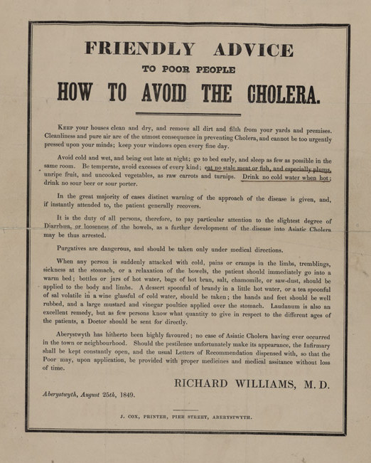

+++ {"slideshow": {"slide_type": "slide"}}

# Lecture 5: Natural Experiments

+++ {"slideshow": {"slide_type": "slide"}}

## Cholera in 19th century England
- Cholera first arrived to England in 1831. 

+++ {"slideshow": {"slide_type": "fragment"}}

- 31,000 people died of cholera between 1831-1832.

+++ {"slideshow": {"slide_type": "fragment"}}

- A second outbreak in 1848 killed 62,000.

+++ {"slideshow": {"slide_type": "slide"}}


Source: Punch (1858), cited in https://scpoecon.github.io/ScPoEconometrics/IV.html.

+++ {"slideshow": {"slide_type": "slide"}}


Source: https://www.sciencemuseum.org.uk/objects-and-stories/medicine/cholera-victorian-london

+++ {"slideshow": {"slide_type": "slide"}}

## What causes Cholera?

- Germs had not yet been discovered, and were only one (unpopular) theory.

+++ {"slideshow": {"slide_type": "fragment"}}

* Miasmas (poisonous particles floating in the air):
    - Rapid industrialisation created filthy, unsanitary neighborhoods that tended to be the focal points of disease and epidemics.
    - By improving sanitation and cleanliness, levels of disease were seen to fall, which seemed to support the miasma theory.

+++ {"slideshow": {"slide_type": "fragment"}}

- Other theories
    * Imbalances in the humors of the body (black bile, yellow bile, blood, phlegm)
    * Poison in the ground

+++ {"slideshow": {"slide_type": "slide"}}



+++ {"slideshow": {"slide_type": "slide"}, "cell_style": "split"}

## John Snow

* John Snow was a physician in London who, by watching the course of the disease, came to believe believe that Cholera was caused by a living organism that is ingested (with water or food), multiplies within the body, and is expelled back into the environment.</li>

* Snow developed arguments to support his theory, for example:
  * Cholera spreads along trading routes
  * When sailors went somewhere with Cholera, they wouldn't get sick if no one left the boat.

* Nonetheless, there remained considerable skepticism.

+++ {"slideshow": {"slide_type": "-"}, "cell_style": "split"}


+++ {"slideshow": {"slide_type": "slide"}, "cell_style": "split"}

## John Snow

* John Snow was a physician in London who, by watching the course of the disease, came to believe believe that Cholera was caused by a living organism that is ingested (with water or food), multiplies within the body, and is expelled back into the environment.</li>

* Snow developed arguments to support his theory, for example:
  * Cholera spreads along trading routes
  * When sailors went somewhere with Cholera, they wouldn't get sick if no one left the boat.

* Nonetheless, there remained considerable skepticism.


+++ {"slideshow": {"slide_type": "-"}, "cell_style": "split"}


+++ {"slideshow": {"slide_type": "slide"}}

## Epidemic of 1854

+++ {"slideshow": {"slide_type": "fragment"}}


+++ {"slideshow": {"slide_type": "slide"}}

## Snow's methodology

* Snow identified the first case in London: a man named John Harnold

+++ {"slideshow": {"slide_type": "fragment"}}

* Snow also identified the second case: the man who took Harnold's room after Harnold died.

+++ {"slideshow": {"slide_type": "fragment"}}

* John Harnold had newly arrived by the *Elbe* steamer from Hamburg, where there was an outbreak.

+++ {"slideshow": {"slide_type": "fragment"}}

* Snow also found several adjacent apartment buildings, with one hit by cholera, one not.  He showed that in each case, the affected building had water contaminated by sewage, but the other building had relatively pure water.

+++ {"slideshow": {"slide_type": "slide"}}

### Exceptions

* There was a brewery near the pump, but none of the workers got sick -- it turned out the brewery had its own private pump on-site.

+++ {"slideshow": {"slide_type": "fragment"}}

* A woman in Hampstead got Cholera -- Snow discovered that she had water from the Broad Street pump delivered to her, because she liked the taste.

+++ {"slideshow": {"slide_type": "slide"}}


(Cited in: https://scpoecon.github.io/ScPoEconometrics/IV.html)

+++ {"slideshow": {"slide_type": "slide"}}

According to legend, Snow lobbied the local council to remove the pump handle, at which time the epidemic receded.

+++ {"slideshow": {"slide_type": "-"}}


(Cited in: https://scpoecon.github.io/ScPoEconometrics/IV.html)

+++ {"slideshow": {"slide_type": "slide"}}


(Source: https://livinglondonhistory.com/the-story-of-the-john-snow-pump-in-soho/)

+++ {"slideshow": {"slide_type": "slide"}}

## A natural experiment

> Although the facts shown in the above table afford very strong evidence of the powerful influence which the drinking of water containing the sewage of a town exerts over the spread of cholera, when that disease is present, **yet the question does not end here**; for the intermixing of the water supply of the Southwark and Vauxhall Company with that of the Lambeth Company, over an extensive part of London, admitted of the subject being sifted in such a way as to yield the most incontrovertible proof on one side or the other.  In the subdistricts enumerated in the above table as being supplied by both Companies, the mixing of the supply is of the most intimate kind.  The pipes of each Company go down all the streets, and into nearly all the courts and alleys.  **A few houses are supplied by one Company and a few by the other**, according to the decision of the owner or occupier at that time when the Water Companies were in active competition.  In many cases a single house has a supply different from that on either side.  **Each company supplies both rich and poor, both large houses and small**; there is no difference either in the condition or occupation of the persons receiving the water of the different Companies.

+++ {"slideshow": {"slide_type": "slide"}}

## Snow's reasoning


+++ {"slideshow": {"slide_type": "fragment"}}

* There were several water companies in London, and their service areas overlapped.

+++ {"slideshow": {"slide_type": "fragment"}}

* On a single street, some people would have one company, others another company.

+++ {"slideshow": {"slide_type": "fragment"}}

* The pipes had been laid many years before, when the water companies were still in active competition.

+++ {"slideshow": {"slide_type": "fragment"}}

* In 1852, one of the companies (Lambeth) moved its intake pipe upstream to get purer water

+++ {"slideshow": {"slide_type": "fragment"}}

* Snow compared the death rates between those who got water from Lambeth, and those who got water from Southwark and Vauxhall

+++ {"slideshow": {"slide_type": "slide"}}

## Snow's data

| <i></i>                | Houses | Cholera Deaths | Rate per 10,000 |
|------------------------|--------|----------------|-----------------|
| Southwark and Vauxhall | 40,046 | 1,263          |             315 |
| Lambeth                | 26,107 | 98             |              37 |

```{code-cell} r
---
slideshow:
  slide_type: '-'
---
# test of significance
```

+++ {"slideshow": {"slide_type": "slide"}}

## Snow's analysis in modern terms

- $y_i=1$ if individual $i$ dies of cholera, 0 otherwise.

+++ {"slideshow": {"slide_type": "fragment"}}

- $w_i=1$ if $i$'s water supply is impure, 0 otherewise.

+++ {"slideshow": {"slide_type": "fragment"}}

- Just compute $\operatorname{cor}(y, w)$?

+++ {"slideshow": {"slide_type": "slide"}}

### As regression
- Equivalently, fit the model: $y_i = \alpha + \beta w_i + u_i$
    - $u_i$ are all the other unobservable factors that influence death (poverty, lifestyle, competing hypotheses like miasma, etc.)
    - $\beta$ is the increase in mortality if $w_i:0\to 1$.
- What could go wrong?

+++ {"slideshow": {"slide_type": "slide"}}

$$\mathbb{E}(y_i \mid w_i=1) - \mathbb{E}(y_i \mid w_i=0) = ?$$

+++ {"slideshow": {"slide_type": "slide"}}

### Second attempt

- Let $z_i=1$ if the person drank water from Southwark/Vauxhall and $z_i=0$ if they drank water from Lambeth.
- Now take expectation with respect to $z_i=1/0$.

$$\mathbb{E}(y_i \mid z_i=1) - \mathbb{E}(y_i \mid z_i=0) = ?$$

+++ {"slideshow": {"slide_type": "slide"}}

### Assumptions

What assumptions did we make (implicitily or explicitly) when deriving this estimator? 

- $\mathbb{E}(w_i \mid z_i=1) \neq \mathbb{E}(w_i \mid z_i=0)$
- $\mathbb{E}(u_i \mid z_i=1) = \mathbb{E}(u_i \mid z_i=0)$
- Water company only affects mortality through water purity.

Concretely, what do these assumptions mean for the data that Snow analyzed?

+++ {"slideshow": {"slide_type": "slide"}}

## Yule on pauperism

- Poverty rates in England increased dramatically during the Victorian era.

+++ {"slideshow": {"slide_type": "fragment"}}

- Emerging industrial economy lowered wages, increased population growth, and decreased the prospects for stable employment.

+++ {"slideshow": {"slide_type": "slide"}}

### Victorian poor houses

- Poor people/"paupers" in England were supported either:
    - Inside “poor-houses”;
    - Outside poor-houses, according to local policy.

+++ {"slideshow": {"slide_type": "fragment"}}

- There was a debate about whether poor houses increased or decreased pauperism.

+++ {"slideshow": {"slide_type": "fragment"}}

- Yule studied how these policies affected rates of pauperism.

```{code-cell} r
---
slideshow:
  slide_type: slide
---
# yule's regression
```

+++ {"slideshow": {"slide_type": "slide"}}

## Discussion 🙋‍♀️
- Does Yule establish causation or association?
- What sort of factors could confound the causal interpretation?
- Can you think of a way to measure the *causal* effect?
